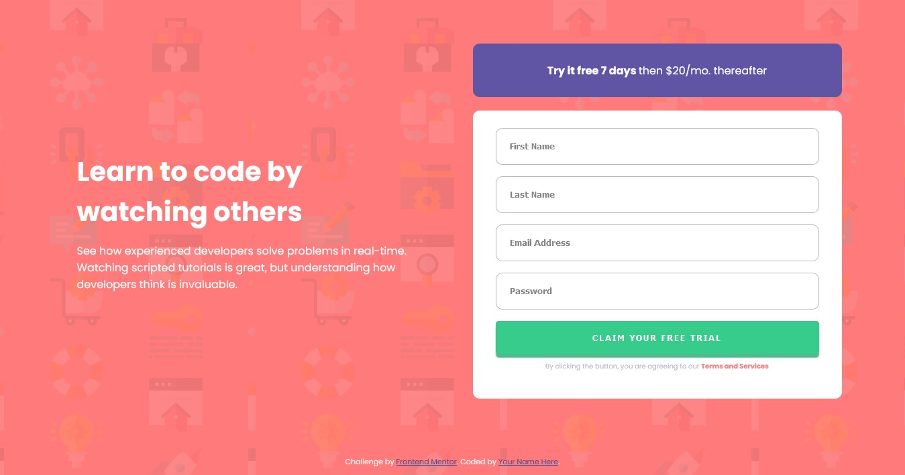

# Frontend Mentor - Intro component with sign up form solution

This is my solution to the [Intro component with sign up form challenge on Frontend Mentor](https://www.frontendmentor.io/challenges/intro-component-with-signup-form-5cf91bd49edda32581d28fd1). Frontend Mentor challenges help you improve your coding skills by building realistic projects. 

## Table of contents

- [Overview](#overview)
  - [The challenge](#the-challenge)
  - [Screenshot](#screenshot)
  - [Links](#links)
- [My process](#my-process)
  - [Built with](#built-with)
  - [What I learned](#what-i-learned)
  - [Continued development](#continued-development)
  - [Useful resources](#useful-resources)
- [Author](#author)

## Overview

### The challenge

Users should be able to:

- View the optimal layout for the site depending on their device's screen size
- See hover states for all interactive elements on the page
- Receive an error message when the `form` is submitted if:
  - Any `input` field is empty. The message for this error should say *"[Field Name] cannot be empty"*
  - The email address is not formatted correctly (i.e. a correct email address should have this structure: `name@host.tld`). The message for this error should say *"Looks like this is not an email"*

### Screenshot

Here is a screenshot of the website I made. I found this project challenging and fun because it has some field to be validated. 

### Links

- Solution URL: [gitHub](https://github.com/tchock42/Frontend-Mentor-Intro-component-with-sign-up-form-solution)
- Live Site URL: [Netlify](https://silver-tartufo-90e211.netlify.app/)

## My process

### Built with

- Semantic HTML5 markup
- CSS custom properties
- Flexbox
- CSS Grid
- Mobile-first workflow

### What I learned

With this project I continue learning about validating forms and javascript. I think this kind of exercises reinforce my knowledge about javascript.

### Continued development

In the next projects I hope I could use gulp and npm elements to make easier the process of development. 

### Useful resources

- [Example resource 1](https://www.stechies.com/) - This site help me to validate the email field. In other frontmentor challenge I only serch for @ and dot, but now I find the place and order of this characters

## Author

- Website - [tchock42](https://github.com/tchock42)
- Frontend Mentor - [@tchock42](https://www.frontendmentor.io/profile/tchock42)

